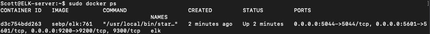

A repository of Cyber Security Sydney Bootcamp activities. This is a collection of Linux Scripts and Ansible Scripts from my CyberClass.

## Automated ELK Stack Deployment

The files in this repository were used to configure the network depicted below.

These files have been tested and used to generate a live ELK deployment on Azure. They can be used to either recreate the entire deployment pictured above. Alternatively, select portions of the _____ file may be used to install only certain pieces of it, such as Filebeat.

  - _TODO: /etc/ansible/install-elk.yml

This document contains the following details:
- Description of the Topology
- Access Policies
- ELK Configuration
  - Beats in Use
  - Machines Being Monitored
- How to Use the Ansible Build

### Description of the Topology

The main purpose of this network is to expose a load-balanced and monitored instance of DVWA, the D*mn Vulnerable Web Application.

Load balancing ensures that the application will be highly available, in addition to restricting in-bound access to the network.

- What aspect of security do load balancers protect? What is the advantage of a jump box?

A load balancer intelligently distributes traffic from clients across multiple servers without the clients having to understand how many servers are in use or how they are configured. Because the load balancer sits between the clients and the servers it can enhance the user experience by providing additional security, performance, resilience and simplify scaling your website.

A jump box is a secure computer that all admins first connect to before launching any administrative task or use as an origination point to connect to other servers or untrusted environments.

Integrating an ELK server allows users to easily monitor the vulnerable VMs for changes to the servers and system files.

- _TODO: What does Filebeat watch for?_

Filebeat monitors the log files or locations specified, collects log events and forwards them for indexing.

- _TODO: What does Metricbeat record?_

Metricbeat takes the metrics and statistics that it collects and ships them to a specified output.

The configuration details of each machine may be found below.

| Name       | Function   | IP Address | Operating System |
|------------|------------|------------|------------------|
| Jump Box   | Gateway    | 10.0.0.4   | Ubuntu Linux     |
| Web-1      | Webserver  | 10.0.0.5   | Ubuntu Linux     |
| Web-2      | Webserver  | 10.0.0.6   | Ubuntu Linux     |
| Web-3      | Webserver  | 10.0.0.7   | Ubuntu Linux     |
| ELK-Server | Monitoring | 10.1.0.4   | Ubuntu Linux     |

### Access Policies

The machines on the internal network are not exposed to the public Internet. 

Only the Jump Box provisioner machine can accept connections from the Internet. Access to this machine is only allowed from the following IP addresses:
- _TODO: 125.128.34.215

Machines within the network can only be accessed by the Jump Box Provisioner.
- _TODO: Which machine did you allow to access your ELK VM? What was its IP address?_ 

The Jumpbox Provisioner has access to the ELK VM through the internal network - 10.0.0.4

A summary of the access policies in place can be found in the table below.

| Name              | Publicly Accessible | Allowed IP Addresses     |
|-------------------|---------------------|--------------------------|
| Jump Box          | Yes                 | 125.128.34.215           |
| Web-1,2,3         | No                  | 10.0.0.4                 |
| Web Load Balancer | Yes                 | *                        |
| Elk Server        | Yes                 | 10.0.0.4, 125.128.34.215 |

### Elk Configuration

Ansible was used to automate configuration of the ELK machine. No configuration was performed manually, which is advantageous because...
- _TODO: What are the main advantages of automating configuration with Ansible?_

Free: Ansible is an open-source tool.
Very simple to set up and use: No special coding skills are necessary to use Ansible’s playbooks (more on playbooks later).
Powerful: Ansible lets you model even highly complex IT workflows.
Flexible: You can orchestrate the entire application environment no matter where it’s deployed. You can also customize it based on your needs.
Agentless: You don’t need to install any other software or firewall ports on the client systems you want to automate. You also don’t have to set up a separate management structure.
Efficient: Because you don’t need to install any extra software, there’s more room for application resources on your server.

The playbook implements the following tasks:
- _TODO: In 3-5 bullets, explain the steps of the ELK installation play. E.g., install Docker; download image; etc._

Install Docker: Installs the core docker code to the remote server.
Install Python3_pip: Pip is an installation module that allows for additional docker modules to be installed easier.
Docker Module: Tells the previous PIP module to install the necessary docker component modules.
Increase Memory/Use More Memory: A common issue with the ELK Docker image is to little memory. This help fix the issue to allow the server to launch.
Download and Launch ELK Container: This downloads the ELK docker container and initializes it with the specified ports being published.
- 

The following screenshot displays the result of running `docker ps` after successfully configuring the ELK instance.

### Target Machines & Beats
This ELK server is configured to monitor the following machines:
- _TODO: List the IP addresses of the machines you are monitoring_

| Name  | Ip Address |
|-------|------------|
| Web-1 | 10.0.0.5   |
| Web-2 | 10.0.0.6   |
| Web-3 | 10.0.0.7   |

We have installed the following Beats on these machines:
- _TODO: Specify which Beats you successfully installed_

Filebeats
Metricbeats

These Beats allow us to collect the following information from each machine:
- _TODO: In 1-2 sentences, explain what kind of data each beat collects, and provide 1 example of what you expect to see. E.g., `Winlogbeat` collects Windows logs, which we use to track user logon events, etc._

Filebeats collects system type events such as logins to see who is actively logging into the system.
Metricbeats collects useful information such as cpu usage and memory, this is particularly useful when seeing if there are any aberant programs or behaviors taking system resources.

### Using the Playbook
In order to use the playbook, you will need to have an Ansible control node already configured. Assuming you have such a control node provisioned: 

SSH into the control node and follow the steps below:
- Copy the filebeat-playbook.yml file to /etc/ansible/roles/ directory.
- Update the hosts file to include the attribute, such as elk, then include the destination ip of the ELK server.
- Run the playbook, and navigate to http://[your_elk_server_ip]:5601/app/kibana, then go to Filebeat and Metric to check that the installation worked as expected.

_As a **Bonus**, provide the specific commands the user will need to run to download the playbook, update the files, etc._
